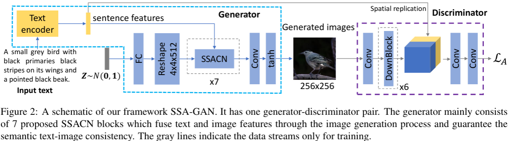
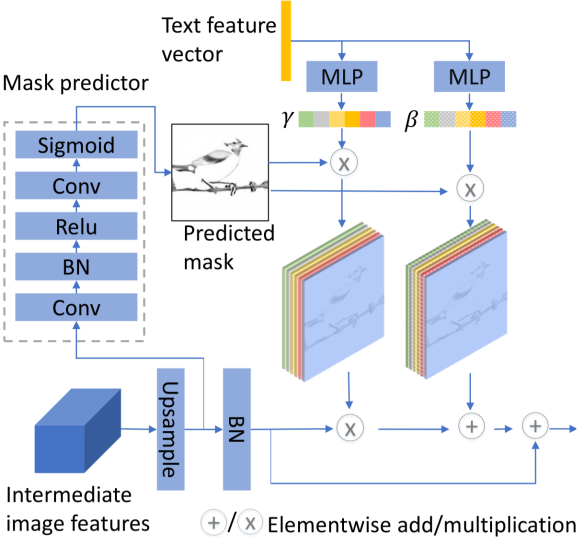
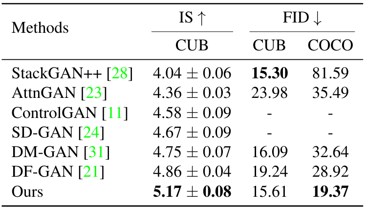
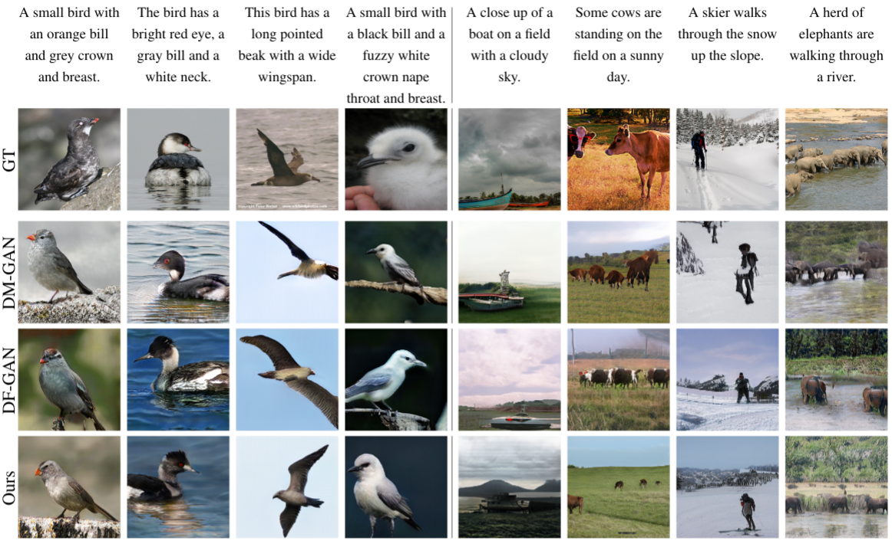
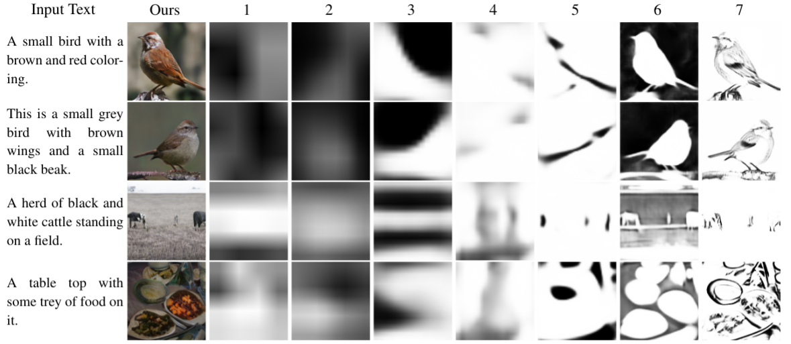

# text2image
This repository includes the implementation for [Text to Image Generation with Semantic-Spatial Aware GAN](https://arxiv.org/abs/2104.00567)

This repo is not completely.

## Network Structure


The structure of the spatial-semantic aware convolutional network (SSACN) is shown as below



## Main Requirements
* python 3.6+
* pytorch 1.0+
* numpy
* matplotlib
* opencv


## TODO
- [x] instruction to prepare dataset
- [ ] remove all unnecessary files
- [x] add link to download our pre-trained model
- [ ] clean code including comments
- [ ] instruction for training
- [ ] instruction for evaluation

## Prepare data
1. Download the preprocessed metadata for [birds](https://drive.google.com/open?id=1O_LtUP9sch09QH3s_EBAgLEctBQ5JBSJ) and [coco](https://drive.google.com/open?id=1rSnbIGNDGZeHlsUlLdahj0RJ9oo6lgH9) and save them to `data/`
2. Download [birds](http://www.vision.caltech.edu/visipedia/CUB-200-2011.html) dataset and extract the images to `data/birds/`
3. Download [coco](http://cocodataset.org/#download) dataset and extract the images to `data/coco/`

## Pre-trained DAMSM model
1. Download the [pre-trained DAMSM for bird](https://drive.google.com/open?id=1GNUKjVeyWYBJ8hEU-yrfYQpDOkxEyP3V) for CUB and save it to `DAMSMencoders/`
2. Download the [pre-trained DAMSM for coco](https://drive.google.com/open?id=1zIrXCE9F6yfbEJIbNP5-YrEe2pZcPSGJ) for coco and save it to `DAMSMencoders/`

## Trained model
you can download our trained models from our [onedrive repo](https://1drv.ms/u/s!At2RxWvE6z1zgvEoglA1flTSnHZqHg?e=TtJNEW)

## Start training
Run main.py file. Please adjust args in the file as your need.


## Evaluation
please run `IS.py` and `test_lpips.py` (remember to change the image path) to evaluate the `IS` and `diversity` scores, respectively.

For evaluating the `FID` score, please use this repo https://github.com/bioinf-jku/TTUR.


## Performance
You will get the scores close to below after training under xe loss for xxxxx epochs:



## Qualitative Results
Some qualitative results on coco and birds dataset from different methods are shown as follows:


The predicted mask maps on different stages are shown as as follows:


## Reference

If you find this repo helpful in your research, please consider citing our paper:

```
@article{liao2021text,
  title={Text to Image Generation with Semantic-Spatial Aware GAN},
  author={Liao, Wentong and Hu, Kai and Yang, Michael Ying and Rosenhahn, Bodo},
  journal={arXiv preprint arXiv:2104.00567},
  year={2021}
}
```
The code is released for academic research use only. For commercial use, please contact [Wentong Liao](http://www.tnt.uni-hannover.de/en/staff/liao/).

## Acknowledgements

This implementation borrows part of the code from [DF-GAN](https://github.com/tobran/DF-GAN).
